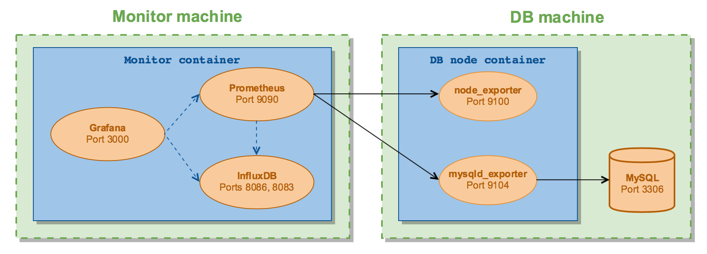

# Docker container with Grafana, Prometheus and InfluxDB

 * [Prometheus](http://prometheus.io/) - monitoring system and time series database.
 * [Grafana](http://grafana.org/) - feature rich metrics dashboard and graph editor for Graphite, InfluxDB, OpenTSDB etc.
 * [InfluxDB](https://influxdata.com/time-series-platform/influxdb/) - time-series database with high availability and performance requirements. 
 * [node_exporter](https://github.com/prometheus/node_exporter) - Prometheus exporter for machine metrics.
 * [mysqld_exporter](https://github.com/prometheus/mysqld_exporter) - Prometheus exporter for MySQL server metrics.

On the diagram, you can see the connections between 3 docker containers we are going to use.
The containers themselves may run on different host machines, not necessary the same one.
For demo purpose, my host machine has IP `192.168.56.107` and will run all three containers.
Note, under a host machine can be even a virtual machine.

### Running Grafana+Prometheus+InfluxDB container

Get the source:

    git clone https://github.com/percona/grafana-prometheus-influx.docker
    cd grafana-prometheus-influx.docker

Edit `prometheus.yml` with the host IPs you are going to monitor.
These are IPs of the machines where Prometheus exporter containers will run.
In my case, it's all `192.168.56.107`.

Build docker image and run container:
    
    docker build -t graf-prom-infl .
    docker run -d -p 3000:3000 -p 9090:9090 -p 8083:8083 -p 8086:8086 --name prom graf-prom-infl

Now you can access:

 * Prometheus `http://<machine_host>:9090`
 * Grafana `http://<machine_host>:3000`
 * InfluxDB `http://<machine_host>:8083`

### Running Prometheus exporters with official containers

Assuming `192.168.56.107` is a host machine being monitored so we will run those containers there.

### mysqld_exporter container

mysqld_exporter needs to connect to MySQL from inside container to wherever MySQL runs.
In my case, it is my host machine which IP is given in `DATA_SOURCE_NAME` when running container (see below).

Create MySQL user `prom@%` with the password `abc123` to use by exporter:

    mysql> GRANT REPLICATION CLIENT, PROCESS ON *.* TO 'prom'@'%' identified by 'abc123';

Run container:

    docker run -d -p 9104:9104 -e DATA_SOURCE_NAME="prom:abc123@(192.168.56.107:3306)/" --name prom-mysql prom/mysqld-exporter -collect.info_schema.tables=false -collect.binlog_size=true -collect.info_schema.processlist=true

Verify:

    docker logs prom-mysql
    curl http://localhost:9104/metrics

### node_exporter container

Run container:

    docker run -d -p 9100:9100 --net="host" --name prom-node prom/node-exporter -collectors.enabled="diskstats,filesystem,loadavg,meminfo,stat,netdev,time,uname"

Verify:

    docker logs prom-mysql
    curl http://localhost:9100/metrics
